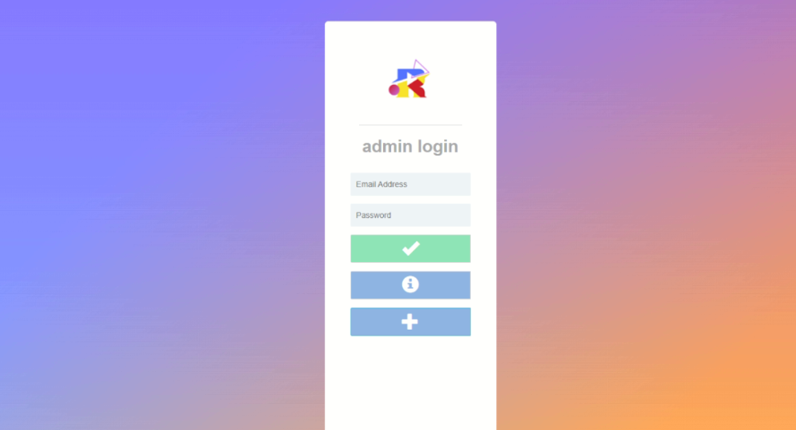
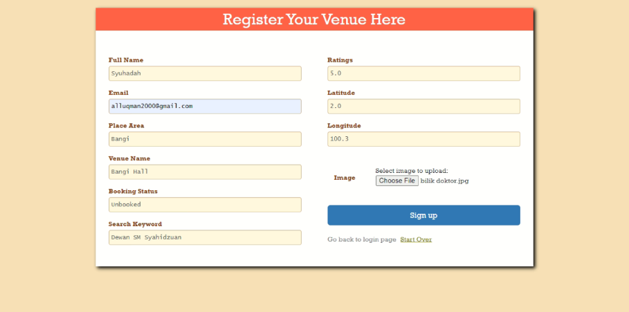
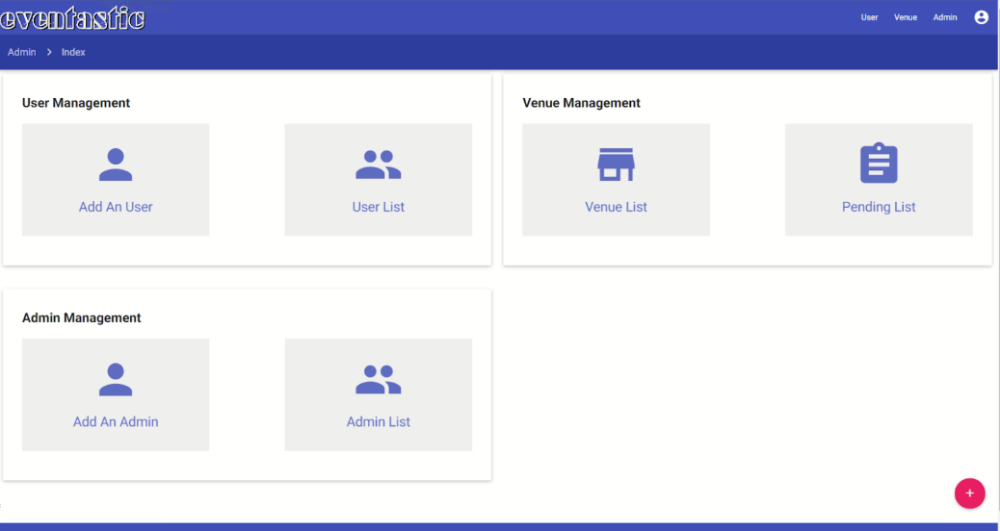
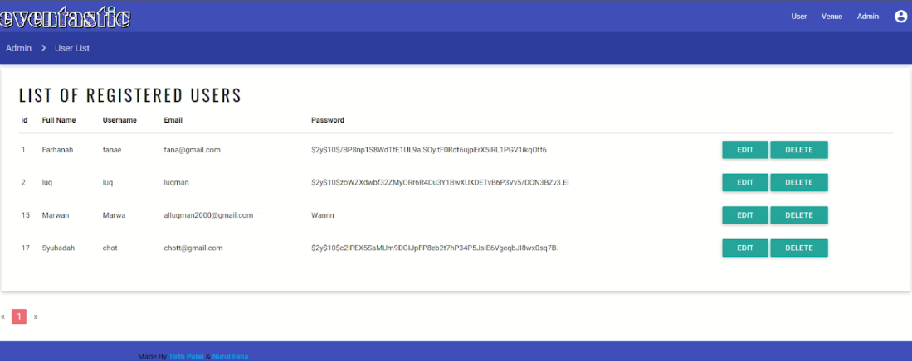
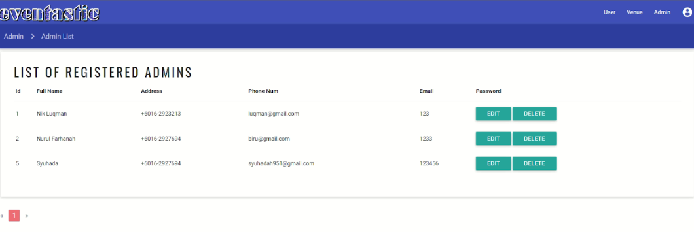
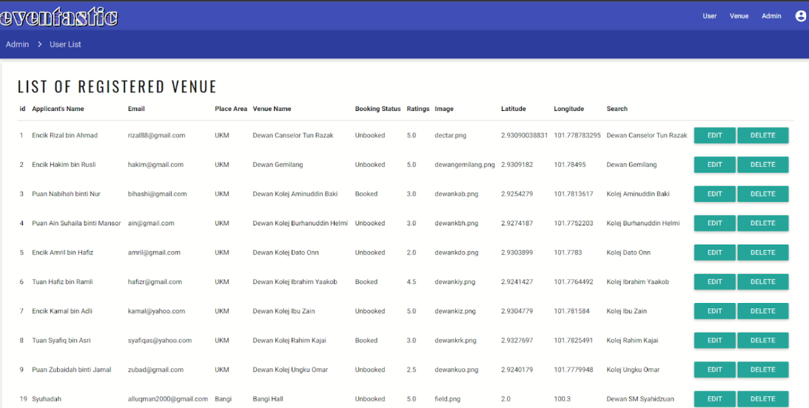

# Overview

This is API for **[Eventastic](https://github.com/luqmaneo/Eventastic)** project and source code for admin website for **[Eventastic](https://github.com/luqmaneo/Eventastic)** mobile app

# Features
1. Admin registration
2. Admin Role:
   - Ability to add new admins.
   - Access the entire user data of the Eventastic Management App application.
   - Approve new event locations added by the location owner.
   - Updating or deleting the user information.
3. User Role:
   - Register venue so that it can be accessed from the Eventastic Management App.
  
# Platform
- Mobile app developed using Java.
- Admin websites developed using HTML, CSS, PHP, and Bootstrap.
- Database used for this development is MYSQL.

# Collaborator
- **[NIK MUHAMMAD LUQMAN HAKIM BIN MOHD ROZAKI](https://github.com/LuqmanMohd)**
- **[NARESH NAIDU A/L PERUMAL NAIDU](https://github.com/DeadPool9090)**
- **[NOR SYUHADAH BINTI ARIFIN](https://github.com/syuhadah99)**

# UI of this project

<table>
     <tr>
         <td>Admin Login</td>
         <td></td>
     </tr>
      <tr>
         <td>Register Venue</td>
         <td></td>
      </tr>
      <tr>
         <td>Main Page</td>
         <td></td>
      </tr>
      <tr>
         <td>User List</td>
         <td></td>
      </tr>
      <tr>
         <td>Admin List</td>
         <td></td>
      </tr>
      <tr>
         <td>Venue List</td>
         <td></td>
      </tr>
</table>
